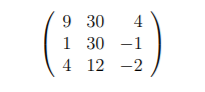

```{r setup, echo=FALSE, cache=FALSE}
library(knitr)
library(rmdformats)

## Global options
options(max.print="75")
opts_chunk$set(echo=TRUE,
	             cache=TRUE,
               prompt=FALSE,
               tidy=TRUE,
               comment=NA,
               message=FALSE,
               warning=FALSE)
opts_knit$set(width=75)

```

# 1. Dado `x = (7, −5, 31, −2, −9, 10, 0, 18)` y dado `y = (2, 2, −3, 1, −99, −10, 10, −7)` realice lo siguiente:

+ Introduzca `x` y `y` como vectores en R

```{r}
x = c(7, -5, 31, -2, -9, 10, 0, 18)
y = c(2, 2, -3, 1, -99, -10, 10, -7)
```

+ Calcule la media, la varianza, la raíz cuadrada y la desviación estándar de `y`.

```{r, warning=FALSE}
#media
mean(y)
#varianza
var(y)
#raiz cuadrada
sqrt(y)
#desviacion estandar
sd(y)
```
+  Calcule la media, la varianza, la raíz cuadrada y la desviación estándar de `x`

```{r, warning=FALSE}
#media
mean(x)
#varianza
var(x)
#raiz cuadrada
sqrt(x)
#desviacion estandar
sd(x)
```
+ Calcule la correlación entre `x` y `y`

```{r}
cor(x,y)
```

+ Escriba un comando en R para extraer las entradas 2 a la 7 de `x`.

```{r}
x[2:7]
```

+ Escriba un comando en R para extraer las entradas de `y` excepto la 2 y la 7.

```{r}
y[-c(2,7)]
```

+ Escriba un comando en R para extraer las entradas de `y` menores a -3 o mayores a 10.

```{r}
y[y< -3 | y > 10]
```

+ Escriba un comando en R para extraer las entradas de `x` mayores a 0 y que sean números pares.

```{r}
x[x >0 & x%%2==0]
```
# 2. Introduzca en R la siguiente matriz a 4 × 3 usando:

`A = matrix(c(1,2,3,4,5,6,7,8,9,10,11,12),nrow=4,"byrow"="true")`

Luego, obtenga algunos elementos de la matriz de la siguiente manera: `A[1,1:3]`, `A[1:4,2]`,`A[3,3]`, `A[11]`, `A[20]`, `A[5,4]`, `A[1,1,1]` y explique qué pasa en cada caso.

```{r}
A = matrix(c(1,2,3,4,5,6,7,8,9,10,11,12),nrow=4,"byrow"="true")
A
A[1,1:3] #Extraigo de la 1era fila las cols 1,2 y 3
A[1:4,2] # Extraigo de todas las filas la columna 2
A[3,3] # Extraigo de la fila 3 la col 3
A[11] #extraigo el indice 11avo de la matriz
A[20] #extraigo la entrada 20 de la matriz pero esta no existe y me devuelve NA

```
```{r, eval=FALSE}
A[5,4] # extraigo la fila 5 col 4 pero no existe pues solo hay 4 filas, me devuelve NA

A[1,1,1] # el tercer indice es incorrecto para A
```


# 3. Investigue para qué sirven los comandos de R `as.matrix(...)` y `as.data.frame(...)`, explique y dé un ejemplo de cada uno.

 + `as.matrix()` cambiar el argumento ingresado en una matriz

```{r}
as.matrix(x)
```

+ `as.data.frame()` cambia el argumento a dataframe.

```{r}
as.data.frame(y)
```

4. Introduzca usando código __R__ (no archivos) en un DataFrame la siguiente tabla de datos:

```{r}
data.frame(Peso = c(56,67,55,57,87,48),
           Edad = c(28,23,19,18,57,13),
           Nivel_Educativo  = factor(x = c("Lic","Bach","Bach","Bach","Dr","MSc"),
                                     levels = c("Bach","Lic","MSc","Dr")))
```

6. En muchas ocasiones nos interesa hacer referencia a determinadas partes o componentes de un vector. Defina el vector `x = (2, −5, 4, 6, −2, 8)`, luego a partir de este vector defina instrucciones en R para generar los siguientes vectores:

+ y = (2, 4, 6, 8), así definido y es el vector formado por las componentes positivas de x.
```{r}

x <- c(2, -5, 4, 6, -2, 8)
y <- x[x>0]

y
```

+ z = (−5, −2), así definido z es el vector formado por las componentes negativas de x.
```{r}
z <- x[x<0]
z
```

+ v = (−5, 4, 6, −2, 8), así definido v es el vector x eliminada la primera componente.
```{r}
v <- x[-1]
v  

```

+ w = (2, 4, −2). así definido w es el vector x tomando las componentes impares.
```{r}

w <- x[c(T,F)]

w
```

# 6. Cargue en un `DataFrame` el archivo `potability_V2.csv` usando el siguiente comando de `R`:

`Datos <- read.table(’potabilidad_V2.csv’,
header=TRUE, sep=’,’,dec=’.’,row.names=1)`

```{r}
Datos <- read.table('datos/potabilidad_V2.csv',
header=TRUE, sep=',',dec='.',row.names=1)
```

y haga lo siguiente:

## Calcule la dimensión de la Tabla de Datos.

```{r}
dim(Datos)
```


## Despliegue las primeras 2 columnas de la tabla de datos.

```{r}
Datos[,c(1,2)]
```

## Ejecute un `summary` y un `str` de los datos.

```{r}

summary(Datos)

str(Datos)

```

## Calcule la Media y la Desviación Estándar para todas las variables cualesquiera.

```{r,warning=FALSE}

lapply(Datos, mean)


lapply(Datos, sd)
```

## Ahora repita los ítems anteriores pero leyendo el archivo como sigue:

`Datos <- read.table(’potabilidad_V2.csv’,
header=TRUE, sep=’;’,dec=’,’,row.names=1)`

```{r, eval=FALSE}
Datos <- read.table("datos/potabilidad_V2.csv",
header=TRUE, sep=";",dec=",",row.names=1)


dim(Datos)
Datos[,c(1,2)]
summary(Datos)
mean(Datos)
sd(Datos)
```

Explique porqué todo da mal o genera error.

Todo da mal debido a que se cargaron mal los datos, con "," como decimal y ";" como separador.

# 7. Cargue la tabla de datos que está en el archivo `SAheartv.csv` haga lo siguiente:

```{r}
datos <- read.table("datos/SAheart.csv", header = TRUE, sep = ";", dec = ".", stringsAsFactors = 1)
```


## Calcule la dimensión de la Tabla de Datos.

```{r}
dim(datos)
```

## Despliegue las primeras 3 columnas de la tabla de datos.

```{r}
datos[,c(1:3)]
```

## Ejecute un `summary` y un `str` de los datos.

```{r}
summary(datos)

str(datos)
```

## Usando el comando `cor` de R calcule la correlación entre las variables `tobacco` y `alcohol`.

```{r}
cor(datos[,c(2,8)])
```

## Calcule la suma de las columnas con variables cuantitativas (numéricas).

```{r}

num.datos <- Filter(is.numeric,datos)

lapply(num.datos, sum)
```

## Calcule para todas las variables cuantitativas presentes en el archivo `SAheart.csv`: El mínimo, el máximo, la media, la mediana y para la variables `chd` determine la cantidad de Si y de No.

```{r}
summary(datos)[,c(5,10)]
summary(datos)[c(1,3,4,6),c(1,2,3,4,6,7,8,9)]
```
# 8. Programe en R una función que genera 200 números al azar entre 1 y 500 y luego calcula cuántos están entre el 50 y 450, ambos inclusive.

```{r}

funcionRandom <- function(){
  
  n <- sample(1:500, 200)
  n <- length(n[n>50 & n < 450])
  cat("Hay", n, "números entre 50 y 450")
}

funcionRandom()

```

# 9. Desarrolle una función que calcula el costo de una llamada telefónica que ha durado _t_ minutos sabiendo que si _t < 1_ el costo es de 0,4 dólares, mientras que para duraciones superiores el costo es de _0,4 + (t − 1)/4_ dólares, la función debe recibir el valor de _t_.

```{r}

costoTel <- function(t){
  costo <- 0
  if(t<1){
    costo = 0.4
  } else{
    costo = 0.4 + (t-1)/4
  }
  
  cat("El costo de la llamada fue de", costo, "dólares")
}

costoTel(0.5)
costoTel(5)
```
# 10. Desarrolle una función que recibe una matriz cuadrada A de tamaño _n × n_ y calcula su traza, es decir, la suma de los elementos de la diagonal. Por ejemplo, la traza de la siguiente matriz:



es 37.

```{r}
A <- matrix(c(9,30,4,1,30,-1,4,12,-2), nrow = 3, byrow = T)


traza <- function(m){
  if(nrow(m) != ncol(m)){
    print("La matriz no es cuadrada")
  } else{
    cat("La traza de la matriz es", sum(diag(m)))
  }
}

traza(A)
```

# 12. Escriba una función que retorne cúal es el mayor número entero cuyo cuadrado no excede de _x_ donde _x_ es un número real que se recibe como parámetro, utilizando `while`.

```{r}
cuadrado <- function(x){
  i <- 1
  while(i^2 < x){
    i <- i+1
  }
  
  return(i-1)
}

cuadrado(500)
```
# 13. Crear un Data Frame con diez alumnos con su edad, año de nacimiento y número de teléfono. Deberá aparecer el nombre de la columna (edad, año de nacimiento, teléfono) y el nombre de la fila, que será el nombre del alumno al que corresponden los datos.

```{r}
alumnos <- data.frame(edad = c(8,8,9,9,9,8,9,9,10,8),
           annoNac = c(2011,2011,2011,2011,2011,2011,2011,2011,2010,2011),
           numTelef =  as.vector(sample(80000000:89999999,10)))

nombres <- c("Maria","Jose","Ana", "Paula", "Cristina", "Guillermo", "Carlos", "Jason", "Jocelyn", "Luis" )

rownames(alumnos) <- nombres

alumnos
```

# 14. Desarrolle una función R que recibe un DataFrame que retorna la cantidad de entradas de este DataFrame que son divisibles entre 3.

```{r}
esDivisible <- function(x){
  
  divisibles <- 0
  dimensiones <-dim(x)
  for(i in 1:dimensiones[2]){
    for(j in 1:dimensiones[1]){
      if(typeof(x[,i]) == "integer" | typeof(x[,i]) == "numeric"| typeof(x[,i]) == "double"){
        if(x[j,i]%%3 == 0){
          divisibles <- divisibles + 1
        } 
      }
    }
  }
  return(divisibles)
}

esDivisible(alumnos)

```
# 15. Desarrolle una función R que recibe un DataFrame y dos números de columna y que retorna en una lista el nombre de las variables correspondientes a las columnas, la covarianza y la correlación entre esas dos variables

```{r}

columnas <- function(data,c1,c2){
   lista <- list(names(data[,c(c1,c2)]),
                cov(data[,c(c1,c2)]),
                cor(data[c(c1,c2)]))
  return(lista)
}

columnas(alumnos,1,2)
```
# 16. Programe la siguiente función recursiva:


\begin{equation}

U(n) = 
  \begin{cases}
            5 & \text{si $n = 0$} \\
            -5 & \text{si $n =1$} \\
            2 & \text{si $n=2$}   \\
            U_{n-1} -11U_{n-2}+U_{n-3} \text{si $n \geq 3 $}
  \end{cases}
\end{equation}

```{r}
recursiva <- function(n){
  if(n==0){
    return(5)
  } else if(n==1){
    return(-5)
  } else if(n==2){
    return(2)
  } else {
    return(recursiva(n-1) - 11*recursiva(n-2)+2*recursiva(n-3))
  } 
}

recursiva(2)
recursiva(3)

```
# 17. Programe usando recursión una función, denominada `collatz(x)`, que retorne la __cantidad__ de repeticiones necesarias para que el valor llegue a 1 según la __Conjetura de Collatz__. Esta conjetura dice que, sea _n_ un número inicial, tras un número finito de repeticiones de la operación se llega a 1. La operación se puede resumir en lo siguiente:

a) Toma cualquier número entero positivo $n$.
b) Si $n$ es par, divida $n$ entre 2.
c) Si $n$ es impar, multiplique $n$ por 3 y sume 1, es decir, 3$n$ + 1.
d) Repite el proceso indefinidamente hasta que el valor sea 1.

Luego calcule: `collatz(16)`, `collatz(x12)` y `collatz(31)`

```{r}

collatz <- function(x){
  i <- 0
  while(x>1){
    i <- i+1
    if(x%%2 == 0){
      x <- x/2
    } else{
      x <- x*3 + 1
    }
  }
  
  cat("Las repeticiones necesarias fueron", i, "\n")
  
}

collatz(16)

collatz(12)

collatz(31)
```

# 18. Un número perfecto es un número entero positivo cuya suma de todos sus factores enteros positivos es igual a el mismo. Por ejemplo, el 6 es un número perfecto ya que sus factores son (1, 2, 3) y la suma de estos es 6. Se clasifica como abundante si la suma de los factores es mayor al número y defectivo si la suma es menor al número. Escriba una función que contenga lo siguiente:

## a) `es.factor`: Determina si un valor es factor o no de otro.

```{r}
es.factor <- function(n,f){
  if(n%%f == 0){
    return(f)
  } else {
    return(0)
  }
}

```

## b) `suma.factores`: Obtiene la suma de los factores de un número. Debe programarla con recursión.

```{r}


suma.factores <- function(n){
  aux <- function(n,m){
    if(n==1){
      return(1)
    } else {
      return(es.factor(m,n) + aux(n-1,m))
    }
 }
  return(aux(n-1,n))
}

suma.factores(9)
```


## c) clasificación: Retorne uno de los siguientes tres símbolos: __'perfecto__, __'defectivo__ o __'abundante.__

```{r}
clasificacion <- function(n){
  
  total <- suma.factores(n)
  
  if(total==n){
    
    cat("El número",n,"es perfecto", "\n")
  
    } else if(total > n){
    
    cat("El número",n,"es abundante", "\n")

  } else{
    
    cat("El número",n,"es defectivo","\n")

  }
}

clasificacion(10)
clasificacion(6)
clasificacion(12)
```


