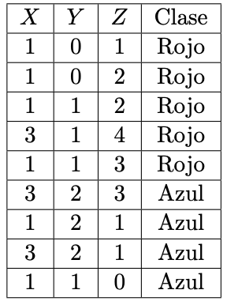
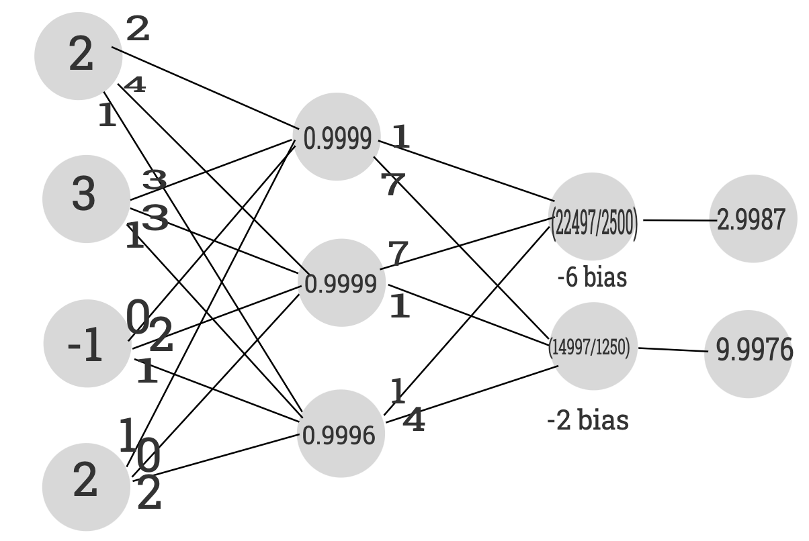
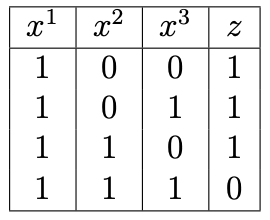
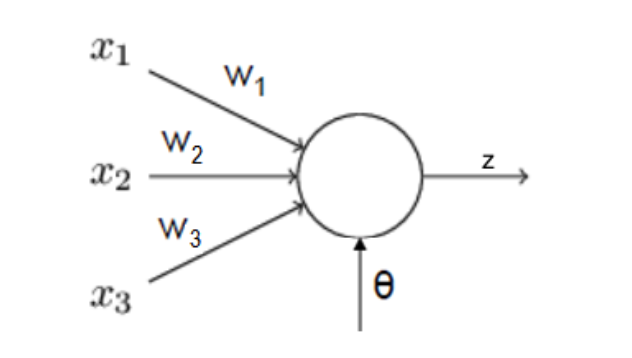

```{r setup, echo=FALSE, cache=FALSE}
library(knitr)
library(rmdformats)

## Global options
options(max.print="75")
opts_chunk$set(echo=TRUE,
	             cache=TRUE,
               prompt=FALSE,
               tidy=TRUE,
               comment=NA,
               message=FALSE,
               warning=FALSE)
opts_knit$set(width=75)
```

```{r,echo=FALSE}
# Residual Sum of Square (RSS)
RSS <- function(Pred,Real) {
  ss <- sum((Real-Pred)^2)
  return(ss)
}
RSE<-function(Pred,Real,NumPred) {
  N<-length(Real)-NumPred-1  # <- length(Real)-(NumPred+1)
  ss<-sqrt((1/N)*RSS(Pred,Real))
  return(ss)
}
MSE <- function(Pred,Real) {
  N<-length(Real)
  ss<-(1/N)*RSS(Pred,Real)
  return(ss)
}
error.relativo <- function(Pred,Real) {
  ss<-sum(abs(Real-Pred))/sum(abs(Real))
  return(ss)
}

# Funciones para desplegar precisión
indices.precision <- function(real, prediccion,cantidad.variables.predictoras) {
  return(list(error.cuadratico = MSE(prediccion,real),
              raiz.error.cuadratico = RSE(prediccion,real,cantidad.variables.predictoras),
              error.relativo = error.relativo(prediccion,real),
              correlacion = as.numeric(cor(prediccion,real))))
}


# Gráfico de dispersión entre el valor real de la variable a predecir y la predicción del modelo.
plot.real.prediccion <- function(real, prediccion, modelo = "") {
  g <- ggplot(data = data.frame(Real = real, Prediccion = as.numeric(prediccion)), mapping = aes(x = Real, y = Prediccion)) +
    geom_point(size = 1, col = "dodgerblue3") +
    labs(title = paste0("Real vs Predicción", ifelse(modelo == "", "", paste(", con", modelo))),
         x = "Real",
         y = "Predicción")
  return(g)
}
```

```{r, echo=FALSE}
Confusion <- function(MC){
  VN <- MC[1,1]
  FN <- MC[2,1]
  VP <- MC[2,2]
  FP <- MC[1,2]
  
  PG <- (VN + VP)/(VN + FP + FN + VP)
  EG <- 1 - PG
  PP <- VP/(FN + VP)
  PN <- VN/(FP + VN)
  FP <- FP/(VN + FP)
  FN <- FN/(VP + FN)
  AP <- VP/(FP + VP)
  AN <- VN/(VN + FN)
  
  Respuesta <- list(PG = PG,EG = EG, PP = PP,PN = PN,FP = FP,FN=FN,AP=AP,AN=AN)
  
  names(Respuesta) <- c("Precision Global", "Error Global","Precision Positiva", "Precision Negativa", "Falsos Positivos", "Falsos Negativos", "Asertividad Positiva" , "Asertividad Negativa")
  
  return(Respuesta)
}
```

# Pregunta 1: __[10 puntos]__ En este ejercicio vamos a usar la tabla de datos `wine.csv`, que contiene variantes del vino “Vinho Verde”. Los datos incluyen variables de pruebas fisicoquímicas y sensoriales realizadas a dicho vino. 

La tabla contiene 1599 filas y 12 columnas, las cuales se explican a continuación.

Para esto realice lo siguiente:

## 1. Cargue la tabla de datos `wine.csv` en `R`.

```{r}
datos <- read.table("../datos/wine.csv", sep = ",", dec = ".", header = T, stringsAsFactors = T)
```

## 2. Usando el comando sample de `R` genere al azar una tabla de testing con una 20 % de los datos y con el resto de los datos genere una tabla de aprendizaje.

```{r}
filas <- dim(datos)[1] 
muestra <- sample(1:filas, floor(filas*0.20))
ttesting <- datos[muestra,]
taprendizaje <- datos[-muestra,]
```

## 3. Use el método de los `SVM` con `traineR` para generar un modelo predictivo para la tabla de aprendizaje. Pruebe con todos los kernel (núcleos) `linear`, `polynomial`, `radial basis` y `sigmoid` hasta encontrar el que minimiza el error global.


### Linear

```{r}
library(traineR)

modelo.linear <- train.svm(tipo~., data = taprendizaje, kernel = "linear")
prediccion.linear <- predict(modelo.linear, ttesting , type = "class")

MC.Linear <- confusion.matrix(ttesting, prediccion.linear)
linear <- general.indexes(mc = MC.Linear)
linear
```

### Polynomial

```{r}
modelo.polynomial <- train.svm(tipo~., data = taprendizaje, kernel = "polynomial")
prediccion.polynomial <- predict(modelo.polynomial, ttesting , type = "class")
MC.polynomial <- confusion.matrix(ttesting, prediccion.polynomial)
polynomial <- general.indexes(mc = MC.polynomial)
polynomial
```

### Radial

```{r}
modelo.radial <- train.svm(tipo~., data = taprendizaje, kernel = "radial")
prediccion.radial <- predict(modelo.radial, ttesting , type = "class")
MC.radial <- confusion.matrix(ttesting, prediccion.radial)
radial <- general.indexes(mc = MC.radial)
radial
```

### Sigmoid

```{r}
modelo.sigmoid <- train.svm(tipo~., data = taprendizaje, kernel = "sigmoid")
prediccion.sigmoid <- predict(modelo.sigmoid, ttesting , type = "class")
MC.sigmoid <- confusion.matrix(ttesting, prediccion.sigmoid)
sigmoid <- general.indexes(mc = MC.sigmoid)
sigmoid
```

## 4. Usando Redes Neuronales con el paquete `traineR` genere un modelo predictivo para la tabla de aprendizaje. Pruebe modificar los parámetros del método hasta encontrar el que minimiza el error global.

```{r}
modelo.nnet <- train.nnet(tipo~. , data = taprendizaje, size = 4, maxit = 1000)

prediccion.nnet <- predict(modelo.nnet, ttesting, type = "class")

MC.nnet <- confusion.matrix(ttesting,prediccion.nnet)

redesNeuronales <- general.indexes(mc=MC.nnet)
redesNeuronales
```

## 5. Construya un DataFrame de manera que en cada una de las filas aparezca un modelo predictivo y en las columnas aparezcan los índices *Precisión Global, Error Global, Precisión Positiva (PP), Precisión Negativa (PN), Falsos Positivos (FP), los Falsos Negativos (FN), la Asertividad Positiva (AP) y la Asertividad Negativa (AN)*. ¿Cuál de los modelos es mejor para estos datos? (incluya todos los métodos que hemos estudiando en el curso).

```{r}
library(dplyr)

precisiones <- rbind(as.data.frame(Confusion(linear$confusion.matrix)),as.data.frame(Confusion(polynomial$confusion.matrix)),as.data.frame(Confusion(radial$confusion.matrix)),as.data.frame(Confusion(sigmoid$confusion.matrix)),as.data.frame(Confusion(redesNeuronales$confusion.matrix)))


tablaC <- read.table("Tabla Comparativa wine2.csv",dec = ".",sep = "," , header = T)

tablaC <- rbind(precisiones,tablaC)

rownames(tablaC) <- c("SVM.linear","SVM.polynomial","SVM.radial","SVM.sigmoid","Redes Neuronales","Árboles de Decisión", "Bosques Aleatorios", "ADA Boosting", "XG Boosting","KNN.rectangular", "KNN.triangular", "KNN.epanechnikov", "KNN.biweight", "KNN.triweight", "KNN.cos",
"KNN.inv", "KNN.gaussian","KNN.optimal")


tablaC %>%
  arrange(desc(Precision.Global))


write.csv(tablaC,"Tabla Comparativa wine3.csv", row.names = FALSE)
tablaC


```
El modelo con la mejor Precisión Global fue KNN con kernel `inv`. Debido a que la Precisión Negativa y Precisión Positiva es bastante buena nos quedamos con este como el mejor modelo.

# Pregunta 2: [10 puntos] Suponga que somos contratados por el banco y se nos pide volver a predecir el monto promedio de deuda en tarjeta de crédito de una cartera de clientes relativamente nuevos, basado en otra cartera de comportamiento y estructura similar de la cual sí se tiene información de deuda en tarjeta de crédito. En este ejercicio hacemos uso de la tabla de datos `DeudaCredito.csv` que contiene información de los clientes en una de las principales carteras de crédito del banco, e incluye variables que describen cada cliente tanto dentro del banco como fuera de este.

Cargue la tabla de datos en `R`, asegúrese que las variables se están leyendo de forma correcta.
Recodifique variables en caso de que sea necesario, tome para entrenamiento un 80 % de la tabla de datos. Realice lo siguiente:

```{r}
library(fastDummies)

datos <- read.table("../datos/DeudaCredito.csv", dec = ".", sep = ",", header = T, stringsAsFactors = T )[,-1]

datos <- dummy_cols(datos, select_columns = c("Genero","Estudiante","Casado","Etnicidad"),remove_selected_columns = T)
str(datos)


numero.predictoras <- dim(datos)[2] - 1
filas <- dim(datos)[1] 
muestra <- sample(1:filas, floor(filas*0.20))
ttesting <- datos[muestra,]
taprendizaje <- datos[-muestra,]
```
## 1. Ejecute un modelo de regresión con `SVM` con todos los kernels disponibles e interprete las medidas de error del mejor de esos modelos.


### Linear

```{r}
library(traineR)

modelo.linear <- train.svm(Balance~., data = taprendizaje, kernel = "linear")
prediccion.linear <- predict(modelo.linear, ttesting)

linear <- indices.precision(ttesting$Balance ,prediccion.linear$prediction,numero.predictoras)
linear
```

### Polynomial

```{r}
modelo.polynomial <- train.svm(Balance~., data = taprendizaje, kernel = "polynomial")
prediccion.polynomial <- predict(modelo.polynomial, ttesting)

polynomial <- indices.precision(ttesting$Balance ,prediccion.polynomial$prediction,numero.predictoras)
polynomial
```

### Radial

```{r}
modelo.radial <- train.svm(Balance~., data = taprendizaje, kernel = "radial")
prediccion.radial <- predict(modelo.radial, ttesting)

radial <- indices.precision(ttesting$Balance ,prediccion.radial$prediction,numero.predictoras)
radial
```

### Sigmoid

```{r}
modelo.sigmoid <- train.svm(Balance~., data = taprendizaje, kernel = "sigmoid")
prediccion.sigmoid <- predict(modelo.sigmoid, ttesting)

sigmoid <- indices.precision(ttesting$Balance ,prediccion.sigmoid$prediction,numero.predictoras)
sigmoid
```

El mejor resultado lo obtuvo `radial`, con una correlación de 98.4% y un error en promedio de 12%. Em promedio se equivocó por 95.35.

## 2. ¿Qué observa en los gráficos de dispersión que muestra los valores reales contra la predicción de cada modelo? ¿Qué desventajas o ventajas puede observar en cada modelo? Explique.

### Linear

```{r}
library(ggplot2)
g <- plot.real.prediccion(ttesting$Balance, prediccion.linear$prediction , modelo = "SVM - Linear")

g + geom_smooth(method = lm, size = 0.4, color = "red", se = FALSE)
```

### polynomial

```{r}
g <- plot.real.prediccion(ttesting$Balance, prediccion.polynomial$prediction , modelo = "SVM - Polynomial")

g + geom_smooth(method = lm, size = 0.4, color = "red", se = FALSE)
```

### radial

```{r}
g <- plot.real.prediccion(ttesting$Balance, prediccion.radial$prediction , modelo = "SVM - Radial")

g + geom_smooth(method = lm, size = 0.4, color = "red", se = FALSE)
```

### Sigmoid

```{r}
g <- plot.real.prediccion(ttesting$Balance, prediccion.sigmoid$prediction , modelo = "SVM - Sigmoid")

g + geom_smooth(method = lm, size = 0.4, color = "red", se = FALSE)
```


## 3. Corra un modelo de redes neuronales usando 2 capas ocultas con 4 y 3 neuronas respectivamente. Ajuste los parámetros hasta que el modelo alcance convergencia (puede iniciar con umbral de detención como 0.05 y número de iteraciones de 50000).


```{r}
library(neuralnet)
library(traineR)
numero.predictoras <- dim(datos)[2] - 1

# Calcula el modelo usando solo los datos de training
# Se deben guardar las medias y las desviaciones
medias <- sapply(taprendizaje, mean) 
desviaciones <- sapply(taprendizaje, sd)
# Se estandarizan los datos, esto se debe hacer de training y testing
taprendizaje.e  <- as.data.frame(scale(taprendizaje, center = medias, scale = desviaciones))
ttesting.e <- as.data.frame(scale(ttesting, center = medias, scale = desviaciones))
# Generamos la fórmula
nombres <- colnames(taprendizaje.e)
formula <- as.formula(paste("Balance ~", paste(nombres[!nombres %in% c("Balance")], collapse = " + ")))
# Generamos modelo. No acepta la notación lpsa~.
# Los parámetros a modificar son hidden, threshold y stepmax
# hidden = c(6, 4, 3) => 3 capas ocultas una con 6 neuronas; otra con 4 neuronas y otra con 3 neuronas
modelo.red <- neuralnet(formula, data = taprendizaje.e, hidden = c(4,3), linear.output = TRUE, threshold = 0.05, stepmax = 50000) 
# Plotea la red
plot(modelo.red, rep = "best", col.entry = "red", col.out = "green", arrow.length = 0.2)


# Predicción
# Primero se obtiene la predicción estandarizada
prediccion.nnet2 <- neuralnet::compute(modelo.red, ttesting.e[, -which(colnames(ttesting.e) == "Balance")])$net.result
# Luego se calcula la predicción final "des-estandarizando" los resultados
prediccion.nnet2 <- prediccion.nnet2 * desviaciones["Balance"] + medias["Balance"]
# Medición de precisión
indices1 <- indices.precision(ttesting$Balance, prediccion.nnet2,numero.predictoras)
indices1
```


## 4. La selección anterior no garantiza que sea la mejor. Intente 2 configuraciones de capas ocultas usando 2 capas y las neuronas que guste siempre y cuando no sean más de 10. Muestre los resultados e interprete los errores de la mejor ¿Alguna de estas configuraciones mejora la configuración del inciso anterior?

```{r}
modelo.red <- neuralnet(formula, data = taprendizaje.e, hidden = c(4,2), linear.output = TRUE, threshold = 0.05, stepmax = 50000) 
# Plotea la red
plot(modelo.red, rep = "best", col.entry = "red", col.out = "green", arrow.length = 0.2)


# Predicción
prediccion.nnet3 <- neuralnet::compute(modelo.red, ttesting.e[, -which(colnames(ttesting.e) == "Balance")])$net.result

prediccion.nnet3 <- prediccion.nnet3 * desviaciones["Balance"] + medias["Balance"]

# Medición de precisión
indices3 <- indices.precision(ttesting$Balance, prediccion.nnet3,numero.predictoras)
indices3
```

```{r}
modelo.red <- neuralnet(formula, data = taprendizaje.e, hidden = c(6,3), linear.output = TRUE, threshold = 0.05, stepmax = 50000) 
# Plotea la red
plot(modelo.red, rep = "best", col.entry = "red", col.out = "green", arrow.length = 0.2)


# Predicción

prediccion.nnet4 <- neuralnet::compute(modelo.red, ttesting.e[, -which(colnames(ttesting.e) == "Balance")])$net.result

prediccion.nnet4 <- prediccion.nnet4 * desviaciones["Balance"] + medias["Balance"]
# Medición de precisión
indices4 <- indices.precision(ttesting$Balance, prediccion.nnet4,numero.predictoras)
indices4

```

Ambas mejoran al aumentar la cantidad de neuronas dentro de la red.

## 5. Intente 2 configuraciones de capas ocultas usando 3 capas y las neuronas que guste siempre y cuando no sean más de 10. Muestre los resultados e interprete los errores de la mejor ¿Alguna de estas 2 configuraciones mejora la configuración del segundo y tercer inciso?

```{r}
modelo.red <- neuralnet(formula, data = taprendizaje.e, hidden = c(8,4,2), linear.output = TRUE, threshold = 0.05, stepmax = 50000) 
# Plotea la red
plot(modelo.red, rep = "best", col.entry = "red", col.out = "green", arrow.length = 0.2)


# Predicción

prediccion.nnet5 <- neuralnet::compute(modelo.red, ttesting.e[, -which(colnames(ttesting.e) == "Balance")])$net.result

prediccion.nnet5 <- prediccion.nnet5 * desviaciones["Balance"] + medias["Balance"]

indices5 <- indices.precision(ttesting$Balance, prediccion.nnet5,numero.predictoras)


indices5
```

```{r}
modelo.red <- neuralnet(formula, data = taprendizaje.e, hidden = c(9,6,3), linear.output = TRUE, threshold = 0.05, stepmax = 50000) 
# Plotea la red
plot(modelo.red, rep = "best", col.entry = "red", col.out = "green", arrow.length = 0.2)


# Predicción

prediccion.nnet6 <- neuralnet::compute(modelo.red, ttesting.e[, -which(colnames(ttesting.e) == "Balance")])$net.result

prediccion.nnet6 <- prediccion.nnet6 * desviaciones["Balance"] + medias["Balance"]
# Medición de precisión
indices6 <- indices.precision(ttesting$Balance, prediccion.nnet6,numero.predictoras)

indices6
```

Ambas son buenas predicciones aunque disminuye su correlación en comparación a la configuración de solo 2 capas.

## 6. Compare los resultados anteriores con los de las tareas anteriores. ¿Cúal es el mejor método para esta tabla de datos?

```{r}
library(dplyr)

errores <- rbind(as.data.frame(linear),as.data.frame(polynomial),as.data.frame(radial),as.data.frame(sigmoid),as.data.frame(indices4))


rownames(errores) <- c("SVM.linear"," SVM.polynomial","SVM.radial","SVM.sigmoid", "NeuralNet 2 capas")

errores

errores %>%
filter(raiz.error.cuadratico == min(errores$raiz.error.cuadratico))
```

Tomando como referencia el error cuadrático medio, el mejor modelo fue el de NeuralNet con dos capas de 6 y 3 neuronas.

El promedio de los errores fue 582.98.

La correlación fue de 97.83% la cual es bastante alta, incluso más alta que con el modelo de Regresión Múltiple de la tarea antes que fue de 99.89%.

En promedio el modelo se equivocó en un 2,96%.


# Pregunta 3: __[10 puntos]__ Un cliente nos contrata esta vez para aplicar un modelo no paramétrico con el fin de estudiar una posible oportunidad de negocio, y para ver si le es rentable quiere una predicción de las ventas potenciales de asientos de niños para autos en su tienda. Para ello nos proporciona la tabla de datos `AsientosNinno.csv` que contiene detalles de ventas de asientos de niños para auto en una serie de tiendas similares a las del cliente, y además los datos incluyen variables que definen caracter´ısticas de la tienda y su localidad. La tabla de datos está formada por 400 filas y 13 columnas. Seguidamente se explican las variables que conforman la tabla.

Cargue la tabla de datos en `R` y no elimine los NA. En caso de ser necesario, recodificar las variables de forma adecuada. Para medir el error tome un 20 % de la tabla de datos. Realice lo siguiente:

```{r}
datos <- read.table("../datos/AsientosNinno.csv", dec = ".", sep = ";",header = T, stringsAsFactors = T)[,-1]
datos$CalidadEstant <- factor(datos$CalidadEstant,levels = c("Malo","Medio","Bueno"), ordered=TRUE)
str(datos)

datos <- dummy_cols(datos, select_columns = c("CalidadEstant"),remove_selected_columns = T)

numero.predictoras <- dim(datos)[2] - 1
filas <- dim(datos)[1] 
muestra <- sample(1:filas, floor(filas*0.20))
ttesting <- datos[muestra,]
taprendizaje <- datos[-muestra,]


#elimino las variables
taprendizaje <- taprendizaje[,-c(4,13)]
ttesting <- ttesting[,-c(4,13)]

```

## 1. Compare en esta tabla de datos todos los métodos de regresión estudiados hasta ahora en el curso ¿Cuál modelo prefiere? Justifique sus respuestas.

### Linear

```{r}
library(traineR)

modelo.linear <- train.svm(Ventas~., data = taprendizaje, kernel = "linear")
prediccion.linear <- predict(modelo.linear, ttesting)

linear <- indices.precision(ttesting$Ventas ,prediccion.linear$prediction,numero.predictoras)
linear
```

### Polynomial

```{r}
modelo.polynomial <- train.svm(Ventas~., data = taprendizaje, kernel = "polynomial")
prediccion.polynomial <- predict(modelo.polynomial, ttesting)

polynomial <- indices.precision(ttesting$Ventas ,prediccion.polynomial$prediction,numero.predictoras)
polynomial
```

### Radial

```{r}
modelo.radial <- train.svm(Ventas~., data = taprendizaje, kernel = "radial")
prediccion.radial <- predict(modelo.radial, ttesting)

radial <- indices.precision(ttesting$Ventas ,prediccion.radial$prediction,numero.predictoras)
radial
```

### Sigmoid

```{r}
modelo.sigmoid <- train.svm(Ventas~., data = taprendizaje, kernel = "sigmoid")
prediccion.sigmoid <- predict(modelo.sigmoid, ttesting)

sigmoid <- indices.precision(ttesting$Ventas ,prediccion.sigmoid$prediction,numero.predictoras)
sigmoid
```

### NeuralNet

```{r}
library(neuralnet)
library(traineR)

numero.predictoras <- dim(datos)[2] - 1

# Calcula el modelo usando solo los datos de training
# Se deben guardar las medias y las desviaciones
medias <- sapply(taprendizaje, mean) 
desviaciones <- sapply(taprendizaje, sd)
# Se estandarizan los datos, esto se debe hacer de training y testing
taprendizaje.e  <- as.data.frame(scale(taprendizaje, center = medias, scale = desviaciones))
ttesting.e <- as.data.frame(scale(ttesting, center = medias, scale = desviaciones))
# Generamos la fórmula
nombres <- colnames(taprendizaje.e)
formula <- as.formula(paste("Ventas ~", paste(nombres[!nombres %in% c("Ventas")], collapse = " + ")))


modelo.red <- neuralnet(formula, data = taprendizaje.e, hidden = c(4,2), linear.output = TRUE, threshold = 0.05, stepmax = 50000) 
# Plotea la red

plot(modelo.red, rep = "best", col.entry = "red", col.out = "green", arrow.length = 0.2)


# Predicción
# Primero se obtiene la predicción estandarizada
prediccion.nnet <- neuralnet::compute(modelo.red, ttesting.e[, -which(colnames(ttesting.e) == "Ventas")])$net.result
# Luego se calcula la predicción final "des-estandarizando" los resultados
prediccion.nnet <- prediccion.nnet * desviaciones["Ventas"] + medias["Ventas"]
# Medición de precisión
NNET <- indices.precision(ttesting$Ventas, prediccion.nnet,numero.predictoras)
NNET
```

```{r}
errores <- rbind(as.data.frame(linear),as.data.frame(polynomial),as.data.frame(radial),as.data.frame(sigmoid),as.data.frame(NNET))


rownames(errores) <- c("SVM.linear"," SVM.polynomial","SVM.radial","SVM.sigmoid", "NeuralNet")

errores

errores %>%
filter(raiz.error.cuadratico == min(errores$raiz.error.cuadratico))
```

Tomando como referencia el error cuadrático medio, el mejor modelo fue SVM con núcleo linear.

El promedio de los errores fue 0.87.

La correlación fue de 97.83% la cual es bastante alta, incluso más alta que con el modelo de Regresión Múltiple de la tarea antes que fue de 97.12%.

En promedio el modelo se equivocó en un 10%


# Pregunta 4



Puede observar los puntos con el siguiente código:
library ( p l o t l y )
datos <− data.frame ( x = c ( 1 , 1 , 1 , 3 , 1 , 3 , 1 , 3 , 1 ) ,
  y = c ( 0 , 0 , 1 , 1 , 1 , 2 , 2 , 2 , 1 ) ,
  z = c ( 1 , 2 , 2 , 4 , 3 , 3 , 1 , 1 , 0 ) ,
  c l a s e = c ( ”Rojo” , ”Rojo” , ”Rojo” ,
                ”Rojo” , ”Rojo” , ”Azul” ,
                ”Azul” , ”Azul” , ”Azul” ) )
                
plot_ly (data = datos ) %> %
  add trace ( x = ˜x , y = ˜y , z = ˜z , c o l o r = ˜ cl a s e ,
          colors = c ( ”#0C4B8E” , ”#BF382A” ) ,
          mode = ” markers ” , type = ” s c a t t e r 3 d ” )

Realice lo siguiente:

## 1. Dibuje con colores los puntos de ambas clases en $\mathbb{R}^3$

```{r}
library(plotly)
Datos <- data.frame ( x = c(1 , 1 , 1 , 3 , 1 , 3 , 1 , 3 , 1) ,y = c(0 , 0 , 1 , 1 , 1 , 2 , 2 , 2 , 1) , z = c(1 , 2 , 2 , 4 , 3 , 3 , 1 , 1 , 0) ,clase = c(" Rojo ", " Rojo ", " Rojo "," Rojo ", " Rojo ", " Azul "," Azul ", " Azul ", " Azul ")) 
plot_ly(data = Datos) %>% add_trace ( x = ~x , y = ~y , z = ~z , color = ~clase , colors = c("#0C4B8E", "#BF382A") , mode = "markers", type = "scatter3d")
```

## 2. Dibuje el hiperplano óptimo de separación e indique la ecuación de dicho hiperplano de la forma $ax + by + cz + d = 0$. Nota: Se debe observar con detenimiento los puntos de ambas clases para encontrar los vectores de soporte de cada margen y trazar con estos puntos los
hiperplanos de los márgenes luego trazar el hiperplano de soporte justo en el centro.

```{r}
Datos2 <- data.frame ( x = c(1 , 1 , 3 ) ,y = c(0 , 1 , 1 ) , z = c(1 , 2 , 4 )) 
Datos3 <- data.frame ( x = c(1 , 1 , 3 ) ,y = c(1 , 2 , 2 ) , z = c(0 , 1 , 3 )) 
Datos4<-data.frame ( x = c(1 , 1 , 3 ) ,y = c(0.5 , 1.5 , 1.5 ) , z = c(0.5 , 1.5 , 3.5 ))

plot_ly(data = Datos) %>% add_trace ( x = ~x , y = ~y , z = ~z , color = ~clase , colors = c("#0C4B8E", "#BF382A") , mode = "markers", type = "scatter3d") %>% add_trace(data = Datos2, x = ~x , y = ~y , z = ~z ,  mode = 'lines', type = "scatter3d",showlegend=FALSE) %>% add_trace(data = Datos3, x = ~x , y = ~y , z = ~z ,  mode = 'lines', type = "scatter3d" ,   showlegend=FALSE) %>% add_trace(data = Datos4, x = ~x , y = ~y , z = ~z ,  mode = 'lines', type = "scatter3d" ,   showlegend=FALSE)
```

## 3. Escriba la regla de clasificación para el clasificador con margen máximo. Debe ser algo como lo siguiente: $w = (w1, w2, w3)$ se clasifica como *Rojo* si $ax + by + cz + d > 0$ y otro caso se clasifica como *Azul*.

+ $w = (w1, w2, w3)$ se clasifica como *Rojo* si $2x + 2y - 2z - 2$ > 0, en cualquier otro caso seria *Azul*.

## 4. Indique el margen para el hiperplano óptimo y los vectores de soporte.

```{r}
library(pracma)
vector.cross <- function(a, b) {
    return (cross(a,b))
}

p<-c(1 , 0.5 , 0.5) 
q<- c(1 , 1.5 , 1.5 ) 
r<-c(3 , 1.5 , 3.5 )
pq<-q-p
pr<-r-p

vector.cross(pq, pr) 

#El margen para el hiperplano optimo es de 1.
#Los vectores de soporte serian:
vector1 <- cross(c(1 , 1 , 3 ) , c(0 , 1 , 1 ))
vector1

vector2 <- cross(c(1 , 2 , 2 )  , c(0 , 1 , 3 ))
vector2
```

## 5. Explique por qué un ligero movimiento de la octava observación no afectaría el hiperplano de margen máximo.

Por que ese  punto no fue utilizado para sacar el hiperplano óptimo por lo cual no afectaría.


## 6. Dibuje un hiperplano que no es el hiperplano óptimo de separación y proporcione la ecuación para este hiperplano.

```{r}
Datos4<-data.frame ( x = c(1 , 1 , 3 ) ,y = c(0 , 1 , 1 ) , z = c(0.5 , 1.5 , 3.5 )) 
plot_ly(data = Datos) %>% add_trace ( x = ~x , y = ~y , z = ~z , color = ~clase , colors = c("#0C4B8E", "#BF382A") , mode = "markers", type = "scatter3d") %>% add_trace(data = Datos2, x = ~x , y = ~y , z = ~z ,  mode = 'lines', type = "scatter3d",showlegend=FALSE) %>% add_trace(data = Datos3, x = ~x , y = ~y , z = ~z ,  mode = 'lines', type = "scatter3d" ,   showlegend=FALSE) %>% add_trace(data = Datos4, x = ~x , y = ~y , z = ~z ,  mode = 'lines', type = "scatter3d" ,   showlegend=FALSE) 
```

```{r}
p<-c(1 , 0 , 0.5 )
q<- c(1, 1 , 1.5 ) 
r<-c(3 , 1 , 3.5 )
pq<-q-p
pr<-r-q

vector.cross(pq, pr) 
```

## 7. Dibuje un hiperplano de separación pero que no es el hiperplano óptimo de separación, y escriba la ecuación correspondiente.

```{r}
Datos4<-data.frame ( x = c(0 , 0 , 2 ) ,y = c( 0.1, 1.1 , 1.1 ) , z = c(0.5 , 1.5 , 3.5 )) 
plot_ly(data = Datos) %>% add_trace ( x = ~x , y = ~y , z = ~z , color = ~clase , colors = c("#0C4B8E", "#BF382A") , mode = "markers", type = "scatter3d") %>% add_trace(data = Datos2, x = ~x , y = ~y , z = ~z ,  mode = 'lines', type = "scatter3d",showlegend=FALSE) %>% add_trace(data = Datos3, x = ~x , y = ~y , z = ~z ,  mode = 'lines', type = "scatter3d" ,   showlegend=FALSE) %>% add_trace(data = Datos4, x = ~x , y = ~y , z = ~z ,  mode = 'lines', type = "scatter3d" ,   showlegend=FALSE) 
```

```{r}
p<-c(0 , 0.1 , 0.5 )
q<- c( 0, 1.1 , 1.5 ) 
r<-c(2 , 1.1 , 3.5 )
pq<-q-p
pr<-r-p
vector.cross(pq, pr)
```

## 8. Dibuje una observación adicional de manera que las dos clases ya no sean separables por un hiperplano.

```{r}
Datos <- data.frame ( x = c(1 , 1 , 1 , 3 , 1 , 3 , 1 , 3 , 1, 2) ,y = c(0 , 0 , 1 , 1 , 1 , 2 , 2 , 2 , 1, 4) , z = c(1 , 2 , 2 , 4 , 3 , 3 , 1 , 1 , 0, 2) ,clase = c(" Rojo ", " Rojo ", " Rojo "," Rojo ", " Rojo ", " Azul "," Azul ", " Azul ", " Azul "," Rojo ")) 

plot_ly(data = Datos) %>% add_trace ( x = ~x , y = ~y , z = ~z , color = ~clase , colors = c("#0C4B8E", "#BF382A") , mode = "markers", type = "scatter3d")


```


# Pregunta 5: __[20 puntos]__ Pruebe que si la función objetivo a minimizar es:

$$
f(w) = \dfrac{||w||^2}{2} + C\Big(\sum _{i=1}^{n}\xi_i \Big)^2,
$$
donde $C$ es un parámetro del modelo, entonces __Lagrangiano Dual__ para la Máquina Vectorial de Soporte lineal con datos no separables es:

$$
L_D = \sum _{i=1}^{n} \lambda_i - \dfrac{1}{2}\sum_{i,j} \lambda_i \lambda_jy_iy_jx_i\cdot x_j - C\Big(\sum _{i=1}^{n}\xi_i \Big)^2.
$$


# Pregunta 6: __[10 puntos]__ Represente en un grafo dirigido la Red Neuronal que tiene la siguiente entrada:

$$ \vec{x}  =  \begin{pmatrix}
2 \\
3 \\
-1 \\
2
\end{pmatrix}
$$
Tiene la siguientes matrices de pesos

$$
W_{1} = \begin{pmatrix}
2 & 3 & 0 & 1 \\
4 & 3 & 2 & 0 \\
1 & 1 & 1 & 2 \\
\end{pmatrix}, \quad  W_{2} = \begin{pmatrix}
1 & 7 & 1 \\
7 & 1 & 4  \\
\end{pmatrix}
$$


Tiene el siguiente bías
$$
\vec{b} = \begin{pmatrix}
-6 \\
-2
\end{pmatrix}
$$

Además, use la siguiente función de activación en todas las neuronas:

$$
g(x) = \dfrac{1}{1+e^{-x}}
$$

$ y = g(W_1 \cdot\vec{x})$

$=g\Bigg(\begin{pmatrix}
2 & 3 & 0 & 1 \\
4 & 3 & 2 & 0 \\
1 & 1 & 1 & 2 \\
\end{pmatrix}$

$\begin{pmatrix}
2 \\
3 \\
-1 \\
2
\end{pmatrix} \Bigg)$

=  $ g \begin{pmatrix}
15 \\
15 \\
8
\end{pmatrix}   = \begin{pmatrix}
0.9999 \\
0.9999 \\
0.9996
\end{pmatrix}$

$ z = g(W_2 \cdot\vec{y} + \vec{b})$

$ = g \Bigg( \begin{pmatrix}
1 & 7 & 1 \\
7 & 1 & 4  \\
\end{pmatrix} $
$\begin{pmatrix}
0.9999 \\
0.9999 \\
0.9996
\end{pmatrix} $
$ + \begin{pmatrix}
-6 \\
-2
\end{pmatrix} \Bigg) $ 
=  $ g \Bigg( \begin{pmatrix}
\dfrac{22497}{2500} \\
\dfrac{14997}{1250} 
\end{pmatrix} $ 
$ + \begin{pmatrix}
-6 \\
-2
\end{pmatrix} \Bigg)$

$ g\begin{pmatrix}
2.9987 \\
9.9976
\end{pmatrix}$ =
$\begin{pmatrix}
0.9525 \\
0.9999
\end{pmatrix}$


<center>

</center>


# Pregunta 7: [no usar traineR, nnet ni neuralnet] [20 puntos] Para la Tabla de Datos que se muestra seguidamente donde $x^j$ para $j = 1, 2, 3$ son las variables predictoras y la variable a
predecir es $z$ diseñe una Red Neuronal de una capa (Perceptron):




Es decir, encuentre todos los posibles pesos  $x_1,w_2,w_3$  y umbrales $\theta$ para la Red Neuronal que se muestra en el siguiente gráfico:



Use una función de activación tipo $tanh(x)$, es decir:

$$f(x) = \tanh(x) = \dfrac{e^{x} - e^{-x}}{e^{x} + e^{-x}}$$
Para esto escriba una Clase en `Python` que incluya los métodos necesarios pra implementar esta Red Neuronal.
Se deben hacer variar los pesos $w_j$ con $j = 1,2,3$ en los siguientes valores `v=(-1,-0.9,-0.8,...,0,...,0.8,0.9,1)` y haga variar θ en `u=(0,0.1,...,0.8,0.9,1)`. Escoja los pesos $w_j$ con $j = 1, 2, 3$ y el umbral θ de manera que se minimiza el error cuadrático medio:

$$E(w_1,w_2,w_3) = \dfrac{1}{4} \sum_{i=1}^{4}\Big[ I\Big[ f\Big(\sum_{j=1}^{3}w_j \cdot x_{i}^{j} - θ \Big)\Big] - z_i\Big]^2 $$

donde $x_i^j$ es la entrada en la fila $i$ de la variable $x^j$ e $I(z)$ se define como sigue:


$$ I(t) = 
  \begin{cases}
            1 & \text{si $t \geq 0$} \\
            0 & \text{si $t < 0$}
  \end{cases} 
$$


```{r cache=TRUE}

x1 <- c(1,1,1,1)
x2 <- c(0,0,1,1)
x3 <- c(0,1,0,1)
z <- c(1,1,1,0)


tabla <- data.frame(x1,x2,x3,z)

#función de activación
tangenteHiperb <- function(x){
  
  y <- 2/(1+exp(-2*x)) - 1
  
  return(y)
} 

I <- function(t){
  if(t >= 0){
    return(1)
  }else {
    return(0)
  }
}

#Pesos
v <- seq(-1,1,0.1)
u <- seq(0,1,0.1) 

error <- data.frame()
  
  
  
for (omega in u) {
  for (w1 in v) {
    for (w2 in v) {
      for (w3 in v) {
        s <- 0
        for (i in 1:4) {
          
          s <- s + (I(tangenteHiperb(w1*tabla[i,1] - omega + w2*tabla[i,2] - omega + w3*tabla[i,3] - omega)) - tabla[i,4])^2
        }
        
        error <- rbind(error,data.frame(w1,w2,w3,omega,s/4))
      }  
    }
    }
  }


```

Pesos y umbral que minimizan el error

```{r}

names(error)[5] <- c("Error")

error%>%filter(Error == 0)
```

# Pregunta 8: __[10 puntos]__ Usando el algoritmo del Descenso de Gradiente encuentre “a mano” un mínimo local de la siguiente función en el intervalo $[−1, 4]$, use el punto de partida que considere adecuados. Luego grafique y verifique los resultados con código `R`.
 
$$
f(x) = 3x^4 - 16x^3 + 18x^2
$$

+ "A mano"
Tome $x_0$ y note que $f'(x) = 12x^3 - 48x^2 + 36x$

__Paso 1 __

$f(x_0) = 3(2)^4 - 16(2)^3 +18(2)^2 = -8$

__Paso 2__

$f'(x_0) = f'(2) = -24 $

__Paso 3__

Tomanto $\eta = 0.05$

$x_1 = x_0 - \eta \cdot f'(x_0) = 2 - 0.05 \cdot -24 = 3.2$

$\Rightarrow f(x_1) = f(3.2)= -25.3952$

Tenemos el par $(3.2,-25.3952)$

+ En `R`

```{r}
funcion <- function(x){
  3 * x^4 -16 * x^3 + 18 * x^2
}

t1 <- c(-5.0,5.0,0.1)

x = 2.0
y = funcion(x)

ggplot()+
  xlim(-5.0,5.0)+
  ylim(-45,45)+ 
  geom_function(fun = funcion)+
  geom_point(aes(x=x,y=y), colour = "red")+
  theme_minimal()

```

```{r}
derivada <- function(x){
  12*x^3 - 48*x^2 + 36*x
}

pendiente <- derivada(x)
pendiente

eta = 0.05

x[2]<- x - eta*pendiente

y[2] <- funcion(x[2])

ggplot()+
  xlim(-1.0,5.0)+
  ylim(-45,45)+ 
  geom_function(fun = funcion)+
  geom_point(aes(x=x,y=y), colour = "red")+
  theme_minimal()
```

# Pregunta 9: __[10 puntos]__ Usando el algoritmo del Descenso de Gradiente encuentre “a mano” el mínimo global de la siguiente función, use un punto de partida que considere adecuado. Luego grafique y verifique los resultados con código `R`.

$$
f(x,y) = x^2 + y^2 -2x-6y+14
$$

Note que $f_x(x,y) = 2x -2$ y $f_y(x,y)= 2y -6$

$\nabla f = 
\begin{bmatrix}
2x - 2 \\
2y -6
\end{bmatrix}$

Sea $x_0 = 
\begin{bmatrix}
-5 \\
5
\end{bmatrix}.
$ Entonces $f(x_0) = 44 $


Tomando $\eta = 0.1$

$x_1 = x_0 - \eta \cdot f'(x_0) = \begin{bmatrix}
-5 \\
5
\end{bmatrix} - 0.1 \cdot \begin{bmatrix}
-12 \\
4
\end{bmatrix} = \begin{bmatrix}
-3.8 \\
4.6
\end{bmatrix}$

$\Rightarrow f(x_1) = f\Big(\begin{bmatrix}
-3.8 \\
4.6
\end{bmatrix}\Big)= -29.5999$


```{r}
funcion <- function(x,y){
  x^2 + y^2 - 2*x - 6*y + 14
}


x = -5
y = 5

x0 = c(x,y)
x0

fx0 <- funcion(x,y)
fx0


gradiente <- function(x,y){
  c(2*x -2 , 2*y -6)
}

gradiente_f <- gradiente(-5,5) 
gradiente_f
eta = 0.1
x1 = x0 - eta * gradiente(-5,5)

x1

z = funcion(x1[1],x1[2])
z

xi = c(x,y)


for(i in c(1,2)){
  xi = xi -eta * gradiente(xi[1],xi[2])
  
  x = append(x,xi[1])
  
  y= append(y,xi[2])

  z = append(z, funcion(xi[1],xi[2]))
  }

x[2]
y[2]
z[2]

data = data.frame(x=seq(-3,3,by=0.05),y=seq(-3,3,0.05),z=funcion(seq(-3,3,by=0.05),seq(-3,3,by=0.05)))

plot_ly() %>% add_trace (data = data, x = data$x , y=  data$y  , z = data$z , colors = c("#0C4B8E", "#BF382A") , mode = "markers", type = "mesh3d")
```

# Ejercicio 10: __[5 puntos]__ Usando el algoritmo del Descenso de Gradiente encuentre “a mano” un mínimo local de la siguiente función, use el punto de partida que considere adecuados. Luego grafique y verifique los resultados con código `Python`.

$$
f(x,y) = x^4 + y^4 -4xy+1
$$

+ A mano

Note que $f_x(x,y) = 4x^3 -4y$ y $f_y(x,y)= 4y^3 -4x$

$\nabla f = 
\begin{bmatrix}
4x^3 - 4y \\
4y^3 - 4x
\end{bmatrix}$

Sea $x_0 = 
\begin{bmatrix}
-0.5 \\
0.5
\end{bmatrix}.
$ Entonces $f(x_0) = 2.125 $


Tomando $\eta = 0.1$

$x_1 = x_0 - \eta \cdot f'(x_0) = \begin{bmatrix}
-0.5 \\
0.5
\end{bmatrix} - 0.1 \cdot \begin{bmatrix}
-2.5 \\
2.5
\end{bmatrix} = \begin{bmatrix}
-0.25 \\
0.25
\end{bmatrix}$

$\Rightarrow f(x_1) = f\Big(\begin{bmatrix}
-0.25 \\
0.25
\end{bmatrix}\Big)= 1.2578$


```{r}
funcion <- function(x,y){
  x^4 + y^4 - 4*x*y + 1
}


x = -0.5
y = 0.5

x0 = c(x,y)
x0

fx0 <- funcion(x,y)
fx0


gradiente <- function(x,y){
  c(4*x^3 - 4*y , 4*y^3 - 4*x)
}

gradiente_f <- gradiente(x,y) 
gradiente_f
eta = 0.1
x1 = x0 - eta * gradiente(x,y)

x1

z = funcion(x1[1],x1[2])
z

xi = c(x,y)


for(i in c(1,2)){
  xi = xi -eta * gradiente(xi[1],xi[2])
  
  x = append(x,xi[1])
  
  y= append(y,xi[2])

  z = append(z, funcion(xi[1],xi[2]))
  }

x[2]
y[2]
z[2]


plot_ly() %>% add_trace ( x = ~x , y = ~y , z = ~z , colors = c("#0C4B8E", "#BF382A") , mode = "markers", type = "scatter3d", xlim(-10,10),ylim(-10,10))
```

