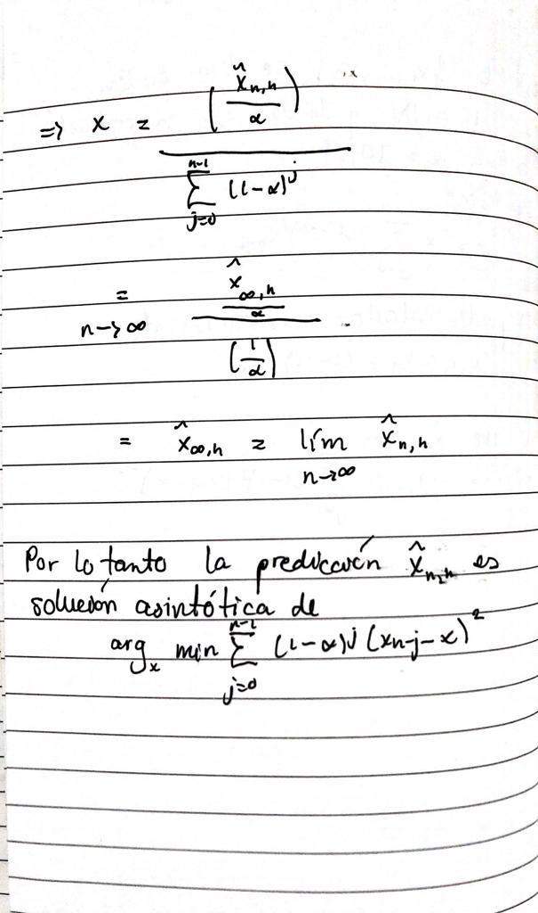

```{r setup, echo=FALSE, cache=FALSE}
library(knitr)
library(rmdformats)

## Global options
options(max.print="75")
opts_chunk$set(echo=TRUE,
	             cache=TRUE,
               prompt=FALSE,
               tidy=TRUE,
               comment=NA,
               message=FALSE,
               warning=FALSE)
opts_knit$set(width=75)

Sys.setlocale(locale = "es_ES.UTF-8")
```

# 1. __[20 puntos]__ El archivo `covid19_CR.csv` contiene la cantidad de casos nuevos diarios registrados en Costa Rica desde el 6 de marzo del 2020 hasta el 23 de abril de 2021. Con la tabla realice lo siguiente:

```{r}
datos <- read.table("../datos/covid19_CR.csv", sep = ";", dec = ".", header = T)
str(datos)
```

## a) Convierta a serie de tiempo en un objeto tipo `ts` utilizando una frecuencia de forma que el Patrón-Estacional sea semanal.

```{r}
library(lubridate)
library(dplyr)

datos <- datos%>%
  mutate(FECHA = as.POSIXct(FECHA, format = "%Y-%m-%d"))

fecha.inicio <- datos[1,1]
fecha.final <- datos[nrow(datos),1]

serie <- ts(datos$casos_nuevos, frequency = 7, start =c(1,wday(fecha.inicio)))

serie
```

## (b) Utilizando el último mes de abril para pruebas y el resto de fechas para entrenamiento genere los modelos de `HOLT-WINTERS`, `HOLT-WINTERS Calibrado` y `Redes Neuronales`, luego en un solo gráfico muestre la serie de entrenamiento, la serie de prueba y el resultado de la predicción de cada uno de los modelos anteriores.

```{r}
library(xts)
library(dplyr)
library(ggplot2)
library(forecast)
library(dygraphs)
library(lubridate)

train.ts <- head(serie, -23)
test.ts <- tail(serie, 23)

```

### HoltWinters

```{r}
modelo.HW <- hw(train.ts,h = 23)
modelo.HW

pred.HW <- forecast(modelo.HW, h = 23)
pred.HW
```

```{r}
calibrar.HW <- function(entrenamiento, prueba, paso = 0.1) {
  # se calculan todas las combinaciones para los parametros
  params <- purrr::cross(list(a = seq(0, 1, by = paso), b = seq(0, 1, by = paso), g = seq(0, 1, by = paso)))
  
  # se calcula un modelos para cada combinacion de parametros
  hw_secure <- purrr::possibly(forecast::hw, otherwise = NULL)
  models <- invisible(purrr::map(params, ~suppressWarnings(hw_secure(
    entrenamiento, alpha = ifelse(.$a == 0, F, .$a), beta = ifelse(.$b == 0, F, .$b), 
    gamma = ifelse(.$g == 0, F, .$g), h = length(prueba)))))
  
  # se realiza la prediccion con cada uno de los modelos
  predictions <- purrr::map(models, ~{
    if (is.null(.)) {
      return(NULL)
    }
    forecast(., h = length(prueba))
  })
  
  # se calcula el error para cada prediccion
  error <- purrr::map_dbl(predictions, ~{
    if (is.null(.)) {
      return(Inf)
    }
    sum((as.numeric(prueba) - as.numeric(.$mean))^2)
  })
  
  # se retorna el modelo con el menor error
  best_model <- models[[which.min(error)]]
  p <- params[[which.min(error)]]
  best_model$call <- call("HoltWinters", y = quote(datos), 
                          alpha = ifelse(p$a == 0, F, p$a), 
                          beta = ifelse(p$b == 0, F, p$b), 
                          gamma = ifelse(p$g == 0, F, p$g))
  return(best_model$call)
}

calibrar.HW(train.ts, test.ts)
```

```{r}
### calibrado HW

modelo.calibrado <- hw(train.ts, alpha = 0.4, beta = 0.3, gamma = 0.1, h = 23)

modelo.calibrado

pred.calibrado <- forecast(modelo.calibrado, h = 23)
pred.calibrado
```


### Redes Neuronales

```{r}
modelo.RN <- nnetar(train.ts, size = 40)
modelo.RN

pred.RN <- forecast(modelo.RN, h = 23)
pred.RN

```

```{r}
predicciones <- ts.union(
  train.ts, Original = test.ts,
  `HW` = pred.HW$mean,
  `HW Calibrado` = pred.calibrado$mean,
  `Redes neuronales` = pred.RN$mean
)

predicciones

fecha_inicio <- dmy(06032020)
fecha <- fecha_inicio + days(0:413)


predicciones <- xts(xts(predicciones, order.by = fecha))

dygraph(predicciones, width = "100%") %>%
  dyRangeSelector()
```


## c) Con un gráfico mida el error de cada uno de los modelos anteriores y determine cual de los modelos es el mejor.

```{r}

RSS <- function(Pred, Real) {
  return(sum((Real - Pred)^2))
}
MSE <- function(Pred, Real) {
  N <- length(Real)
  rss <- sum((Real - Pred)^2)
  return((1/N) * rss)
}
RMSE <- function(Pred, Real) {
  N <- length(Real)
  rss <- sum((Real - Pred)^2)
  return(sqrt((1/N) * rss))
}
RE <- function(Pred, Real) {
    res <- sum(abs(Real - Pred))/sum(abs(Real))
    return(res)
}

tabla.errores <- function(predicciones, real, nombres = NULL) {
    r <- data.frame()
    for (pred in predicciones) {
        r <- rbind(r, data.frame(MSE = MSE(pred, real), RMSE = RMSE(pred, real),
            RE = RE(pred, real), CORR = cor(pred, real)))
    }
    row.names(r) <- nombres
    return(r)
}

grafico.errores <- function(errores) {
    library(ggplot2)
    library(reshape)

    centros <- as.data.frame(apply(errores, 2, function(i) scales::rescale(i, to = c(0,
        100))))

    res <- melt(t(centros), varnames = c("E", "Modelos"))
    res <- res[order(res$E, decreasing = F), ]
    res$M <- as.character(res$M)
    y = c(0, 25, 50, 75, 100)

    ggplot(res, aes(x = E, y = value, group = Modelos, color = Modelos, fill = Modelos)) +
        geom_polygon(alpha = 0.3, size = 1) + geom_point(size = 3) + theme_minimal() +
        theme(axis.text.y = element_blank()) + xlab("") + ylab("") + scale_y_continuous(limits = c(-10,
        100), breaks = y) + annotate("text", x = 0.5, y = y, label = paste0(y, "%"),
        color = "gray60") + ggproto("CordRadar", CoordPolar, theta = "x", r = "y",
        start = 0, direction = sign(1))
}
```

```{r}
errores <- tabla.errores(predicciones = list(pred.HW$mean, pred.calibrado$mean,pred.RN$mean), real = test.ts)
row.names(errores) <- c("HW", "HW.Calibrado","Redes Neuronales")

errores
grafico.errores(errores)
```

El mejor modelo es `Holt -Winters Calibrado`, debido a que tiene mayor correlación y el menor error de todos.

## d) Con el mejor modelo encontrado en el punto anterior genere la predicción de un mes, pero esta vez utilizando toda la serie de tiempo. Grafique la serie original y la predicción junto con el limite inferior y superior.

```{r}
#con toda la serie 
modelo <-  hw(serie,  alpha = 0.4, beta = 0.3, gamma = 0.1, h = 30, level = c(95))
modelo
pred <- forecast(modelo, h = 30)

p <- ts.union(
  prediccion = pred$mean, LimInf = pred$lower, LimSup = pred$upper
)

fecha <- fecha_inicio + days(0:443)

predicciones <- ts.union(serie, p)
predicciones
predicciones <- xts(xts(predicciones, order.by = fecha))

dygraph(predicciones, width = "100%") %>%
  dySeries("serie", label = "Actual") %>%
  dySeries(c("p.LimInf", "p.prediccion", "p.LimSup"), label = "Predicción") %>%
  dyRangeSelector(height = 20, strokeColor = "") %>%  
  dyOptions(axisLineColor = "navy", gridLineColor = "lightblue")
```


# 2. __[35 puntos]__ La tabla trafico `trafico_tren_V2.csv` contiene la cantidad de personas que se suben al metro por hora. Tomando los datos a partir del 15 de Enero del 2016 realice lo siguiente:

```{r}
datos <- read.table("../datos/trafico_tren_V2.csv", sep = ",", dec = ".", header = T)

fecha.inicio <- as.POSIXct("2016-01-15 00:00:00")


datos <- datos %>%
  mutate(date_time = as.POSIXct(date_time, format = "%Y-%m-%d %H:%M:%S"))%>%
  filter(date_time >= fecha.inicio)

fecha.final <- datos[nrow(datos),1]

```

## (a) Encuentre las fechas faltantes y con un suavizado de 25 impute valor a dichas fechas.

```{r}
total.fechas <- seq(fecha.inicio, fecha.final, by = "hour")
faltan.fechas <- total.fechas[!total.fechas %in% datos$date_time]

datos <- union_all(datos, data.frame(date_time = faltan.fechas))
datos <- datos[order(datos$date_time), ]

# función suavizado
suavizado <- function(datos, n) {
  library(zoo)
  if(n %% 2 == 0) {
    izquierda = rep(NA, (floor(n/2) - 1))
    derecha   = rep(NA, floor(n/2))
  } else {
    izquierda = derecha = rep(NA, floor(n/2))
  }
  
  datos <- c(izquierda, datos, derecha)
  return(rollapply(datos, n, mean, na.rm = T))
}

trafico.suavizado <- suavizado(datos$traffic_volume,25)

datos$traffic_volume[which(is.na(datos$traffic_volume))] <- trafico.suavizado[which(is.na(datos$traffic_volume))]

datos
```

## (b) Convierta a serie de tiempo (utilice Patrón-estacional diario).

```{r}
serie <- ts(datos$traffic_volume,frequency = 24, start = c(1,1) )
serie
```

## (c) Usando las últimas 24 horas para pruebas y el resto de fechas para entrenamiento genere los modelos de `HOLT-WINTERS`, `HOLT-WINTERS Calibrado` y `Redes Neuronales`, luego en un solo gráfico muestre la serie de entrenamiento, la serie de prueba y el resultado de la predicción de cada uno de los modelos anteriores.

```{r}
train.ts <- head(serie, -24)
test.ts <- tail(serie, 24)
```

### HOLT-Winter

```{r}
modelo.HW <- hw(train.ts,h = 24)
modelo.HW

pred.HW <- forecast(modelo.HW, h = 24)
pred.HW
```


### calibrado HW

```{r}
library(xts)
library(dplyr)
library(ggplot2)
library(forecast)
library(dygraphs)
library(lubridate)

calibrar.HW <- function(serie.aprendizaje, serie.testing, paso = 0.1) {
    error.c <- Inf
    alpha.i <- paso  # alpha no puede ser cero
    while (alpha.i <= 1) {
        beta.i <- 0
        while (beta.i <= 1) {
            gamma.i <- 0
            while (gamma.i <= 1) {
                mod.i <- HoltWinters(serie.aprendizaje, alpha = alpha.i, beta = beta.i,
                  gamma = gamma.i)
                res.i <- predict(mod.i, n.ahead = length(serie.testing))
                error.i <- sqrt(MSE(res.i, serie.testing))
                if (error.i < error.c) {
                  error.c <- error.i
                  mod.c <- mod.i
                }
                gamma.i <- gamma.i + paso
            }
            beta.i <- beta.i + paso
        }
        alpha.i <- alpha.i + paso
    }
    return(mod.c)
}

calibrar.HW(train.ts, test.ts)

modelo.calibrado <- HoltWinters(train.ts, alpha = 0.1, beta = 0, gamma = 1)


pred.calibrado <- forecast(modelo.calibrado, h = 24)
pred.calibrado

```


### Redes Neuronales

```{r}
modelo.RN <- nnetar(train.ts, size = 10)
modelo.RN

pred.RN <- forecast(modelo.RN, h = 24)
pred.RN

```

```{r}
predicciones <- ts.union(
  train.ts, Original = test.ts,
  `HW` = pred.HW$mean,
  `HW Calibrado` = pred.calibrado$mean,
  `Redes neuronales` = pred.RN$mean
)

predicciones


fecha <- fecha.inicio + days(0:95039)


predicciones <- xts(xts(predicciones, order.by = datos$date_time))

dygraph(predicciones, width = "100%") %>%
  dyRangeSelector()
```


## (d) Con un gráfico mida el error y determine cuál modelo es el mejor.

```{r}
errores <- tabla.errores(predicciones = list(pred.HW$mean, pred.calibrado$mean,pred.RN$mean), real = test.ts)
row.names(errores) <- c("HW", "HW.Calibrado","Redes Neuronales")


grafico.errores(errores)
```

## (e) Con el mejor modelo encontrado en el punto anterior genere la predicción de un día, pero esta vez utilizando toda la serie de tiempo. Grafique la serie original y la predicción junto con el límite inferior y superior con `dygraph`.

```{r}
#con toda la serie 
modelo <-  nnetar(serie, size = 10,level = c(95))

pred <- forecast(modelo, h = 24,PI = TRUE)

p <- ts.union(
  prediccion = pred$mean, LimInf = pred$lower[,
    2], LimSup = pred$upper[, 2])


predicciones <- ts.union(serie, p)

horas <- fecha.inicio + hours(0:23783)
  
predicciones <- xts(xts(predicciones, order.by = horas))

dygraph(predicciones, width = "100%") %>%
  dySeries("serie", label = "Actual") %>%
  dySeries(c("p.LimInf", "p.prediccion", "p.LimSup"), label = "Predicción") %>%
  dyRangeSelector(height = 20, strokeColor = "") %>%  
  dyOptions(axisLineColor = "navy", gridLineColor = "lightblue")
```

# 3. __[30 puntos]__ Para la tabla `Cajero.csv` visto en clase, genere las reglas para la predicción del retiro de dinero de los días 14, 15 y 16 de agosto del 2012. Puede usar la regla que se implementó en el ejemplo de la clase para el día 15 de agosto del 2012.

## 14 de agosto

```{r}
cajero <- read.csv("../datos/Cajero.csv", header = T, dec = ".", sep = ";")


fechas <- seq(as.Date("1998-01-01"), as.Date("2012-07-30"), "day")
cajero$fechas <- fechas

# Eliminamos días bisiestos
cajero <- cajero[!(month(cajero$fechas) == 2 & day(cajero$fechas) == 29), ]

# verificamos si hay valores con NA
cajero$monto[is.na(cajero$monto)]

#14 de agosto
cajero.ragla.14 <- cajero[cajero$fechas < ymd("2011-08-14"), ]
tail(cajero.ragla.14)

serie.regla.14 <- ts(cajero.ragla.14$monto, start = 1998, frequency = 365)
head(serie.regla.14)

modelo.14 <- HoltWinters(serie.regla.14)

prediccion.14.agosto <- forecast(modelo.14, h = 1)
prediccion.14.agosto$mean[1]

real.14.agosto <- cajero[cajero$fechas == ymd("2011-08-14"), "monto"]
real.14.agosto

error <- as.numeric(prediccion.14.agosto$mean[1] - real.14.agosto)
error

if (error < 0) {
    factor.ajuste <- as.numeric(1 + (abs(error)/prediccion.14.agosto$mean[1]))
} else {
    factor.ajuste <- as.numeric(1 - (abs(error)/prediccion.14.agosto$mean[1]))
}

factor.ajuste

prediccion.14.agosto$mean[1] * factor.ajuste

real.14.agosto

serie <- ts(cajero$monto, start = 1998, frequency = 365)
serie

modelo <- HoltWinters(serie)
pred <- forecast(modelo, h = 30)

pred$mean[15]

pred$mean[15] <- pred$mean[15] * factor.ajuste
pred$mean[15]

if (pred$mean[15] > max(serie)) {
    pred$mean[15] <- max(serie)
}
if (pred$mean[15] < min(serie)) {
    pred$mean[15] <- min(serie)
}

serie.pred <- ts.union(serie, Predicción = pred$mean)

fecha.fin <- cajero$fechas[nrow(cajero)]

# Generamos las fechas de la predicción.
fechas <- fecha.fin + days(1:30)

# Unimos con las fechas de la serie original
total.fechas <- c(cajero$fechas, fechas)

serie.pred <- xts(xts(serie.pred, order.by = total.fechas))

dygraph(serie.pred, "Pronóstico de cantidad de dinero del cajero", width = "100%") %>%
  dyAnnotation("2012-08-14", text = "14") %>% # Denotamos el valor de la regla con R
  dyOptions(drawPoints = TRUE, pointSize = 2) %>%
  dyRangeSelector(height = 20, strokeColor = "") %>%
  dyRangeSelector(fillColor = "black", strokeColor = "orange" )
```


## 15 de agosto 

```{r}
#15 de agosto
cajero.ragla.15 <- cajero[cajero$fechas < ymd("2011-08-15"), ]
tail(cajero.ragla.15)

serie.regla.15 <- ts(cajero.ragla.15$monto, start = 1998, frequency = 365)
head(serie.regla.15)

modelo.15 <- HoltWinters(serie.regla.15)

prediccion.15.agosto <- forecast(modelo.15, h = 1)
prediccion.15.agosto$mean[1]

real.15.agosto <- cajero[cajero$fechas == ymd("2011-08-15"), "monto"]
real.15.agosto

error <- as.numeric(prediccion.15.agosto$mean[1] - real.15.agosto)
error

if (error < 0) {
    factor.ajuste <- as.numeric(1 + (abs(error)/prediccion.15.agosto$mean[1]))
} else {
    factor.ajuste <- as.numeric(1 - (abs(error)/prediccion.15.agosto$mean[1]))
}

factor.ajuste

prediccion.15.agosto$mean[1] * factor.ajuste

real.15.agosto

serie <- ts(cajero$monto, start = 1998, frequency = 365)
serie

modelo <- HoltWinters(serie)
pred <- forecast(modelo, h = 30)

pred$mean[16]

pred$mean[16] <- pred$mean[16] * factor.ajuste
pred$mean[16]

if (pred$mean[16] > max(serie)) {
    pred$mean[16] <- max(serie)
}
if (pred$mean[16] < min(serie)) {
    pred$mean[16] <- min(serie)
}

serie.pred <- ts.union(serie, Predicción = pred$mean)

fecha.fin <- cajero$fechas[nrow(cajero)]

# Generamos las fechas de la predicción.
fechas <- fecha.fin + days(1:30)

# Unimos con las fechas de la serie original
total.fechas <- c(cajero$fechas, fechas)

serie.pred <- xts(xts(serie.pred, order.by = total.fechas))

dygraph(serie.pred, "Pronóstico de cantidad de dinero del cajero", width = "100%") %>%
  dyAnnotation("2012-08-15", text = "15") %>% # Denotamos el valor de la regla con R
  dyOptions(drawPoints = TRUE, pointSize = 2) %>%
  dyRangeSelector(height = 20, strokeColor = "") %>%
  dyRangeSelector(fillColor = "black", strokeColor = "orange" )
```


## 16 de agosto

```{r}
#16 de agosto
cajero.ragla.16 <- cajero[cajero$fechas < ymd("2011-08-16"), ]
tail(cajero.ragla.16)

serie.regla.16 <- ts(cajero.ragla.16$monto, start = 1998, frequency = 365)
head(serie.regla.16)

modelo.16 <- HoltWinters(serie.regla.16)

prediccion.16.agosto <- forecast(modelo.16, h = 1)
prediccion.16.agosto$mean[1]

real.16.agosto <- cajero[cajero$fechas == ymd("2011-08-16"), "monto"]
real.16.agosto

error <- as.numeric(prediccion.16.agosto$mean[1] - real.16.agosto)
error

if (error < 0) {
    factor.ajuste <- as.numeric(1 + (abs(error)/prediccion.16.agosto$mean[1]))
} else {
    factor.ajuste <- as.numeric(1 - (abs(error)/prediccion.16.agosto$mean[1]))
}

factor.ajuste

prediccion.16.agosto$mean[1] * factor.ajuste

real.16.agosto

serie <- ts(cajero$monto, start = 1998, frequency = 365)
serie

modelo <- HoltWinters(serie)
pred <- forecast(modelo, h = 30)

pred$mean[17]

pred$mean[17] <- pred$mean[17] * factor.ajuste
pred$mean[17]

if (pred$mean[17] > max(serie)) {
    pred$mean[17] <- max(serie)
}
if (pred$mean[17] < min(serie)) {
    pred$mean[17] <- min(serie)
}

serie.pred <- ts.union(serie, Predicción = pred$mean)

fecha.fin <- cajero$fechas[nrow(cajero)]

# Generamos las fechas de la predicción.
fechas <- fecha.fin + days(1:30)

# Unimos con las fechas de la serie original
total.fechas <- c(cajero$fechas, fechas)

serie.pred <- xts(xts(serie.pred, order.by = total.fechas))

dygraph(serie.pred, "Pronóstico de cantidad de dinero del cajero", width = "100%") %>%
  dyAnnotation("2012-08-16", text = "16") %>% # Denotamos el valor de la regla con R
  dyOptions(drawPoints = TRUE, pointSize = 2) %>%
  dyRangeSelector(height = 20, strokeColor = "") %>%
  dyRangeSelector(fillColor = "black", strokeColor = "orange" )
```

# 4. __[20 puntos]__ Usando el Método Multiplicativo de __Holt-Winters__ que se presenta en las siguientes ecuaciones:

\begin{align*}

\hat{x}_{t+h|t} &= (l_t + hb_t ) \cdot s_{t-m+h^{+}_{m}} \\
l_t &= \alpha \dfrac{y_t}{s_{t-m}} + (1-\alpha)(l_{t-1} + b_{t-1}) \\
b_t &= \beta (l_t -l_{t-1}) + (1-\beta)b_{t-1} \\
s_t &= \gamma \dfrac{y_t}{(l_{t-1}+b_{t-1})}+(1-\gamma)s_{t-m}

\end{align*}

Programe una función recursiva que permita verificar los datos que se muestran en la siguiente tabla, para esto utilice los datos de visitas de turistas a Australia. Además tome $\alpha = 0,441$, $\beta = 0,030$ y $\gamma = 0,002$ (recuerde que estos parámetros se obtienen minimizado el RMSE), además tome $l_0 = 32,49$, $b_0 = 0,70$ y $s_0 = 1,02$:

<center> 

</center> 

```{r, eval=FALSE}
library(fpp2)

data("austourists")
 
datos <- tail(austourists,-24)
```


```{r, eval=FALSE}

# Valores iniciales
m <- 4


alpha <- 0.441
beta <- 0.030
gamma <- 0.002

l0 <- 32.49
b0 <- 0.70
s0 <- 1.02


st.neg <- c(1.24,0.77,0.96,1.02) 


yth <- function(t,m=4){
  if(t == 1){
    return((l0 + 1*b0)*st.neg[t-1 + (trunc((1-1)/m) + 1)])
  }
  if(t<5){
    yt <- (lt(t-1) + 1*bt(t-1))*st.neg[t-1 + (trunc((1-1)/m) + 1)]
  }
  else{
    yt <- (lt(t-1) + 1*bt(t-1))* st(t-1 - m + (trunc((1-1)/m) + 1))
  }
  
  return(yt)
}

lt <- function(t,m=4){
  
  
  if(t==1){
    lt <- alpha*(datos[t]/st.neg[t])+(1-alpha)*(l0 + b0)

  }
  
  if(t<5){
    lt <- alpha*(datos[t]/st.neg[t])+(1-alpha)*(lt(t-1) + bt(t-1))
  }
  
  else{
    lt <- alpha*(datos[t]/st(t-m))+(1-alpha)*(lt(t-1) + bt(t-1))
  }
  return(lt)
}

bt <-function(t){
  
  if(t==1){
  bt <- beta*(lt(1)-l0) + (1-beta)*b0
  }
  else{
    bt <- beta*(lt(t)-lt(t-1)) + (1-beta)*bt(t-1)
  }
  
  return(bt)
}

st <- function(t, m=4){
  if(t==1){
   return(gamma*(datos[t] - l0 - b0) + (1-gamma)*st.neg(t))
  }
  if(t < 4){
    st <- gamma*(datos[t] - lt(t-1) - bt(t-1)) + (1-gamma)*st.neg(t)
  }
  else{
    st <- gamma*(datos[t] - lt(t-1) - bt(t-1)) + (1-gamma)*st.neg(t-m)
  
  }
  return(st)
}

yth(t =1)
```


# 5. __[20 puntos]__ (__Suavizado exponencial simple__) Se tienen $x_1 , ... , x_n$ y se desea pronosticar (predecir) $x_{n+h}$ con $h \in \mathbb{N}$  y donde $\hat{x}_{n,h}$ denota la predicción de $x_{n+h}$. Para $\alpha \in  ]0;1[$ , se define la
predicción por suavizado exponencial simple como sigue:

$$
\hat{x}_{n,h} = \alpha \sum_{j=0}^{n-1}(1-\alpha)^{j} x_{n-j}
$$
Lo anterior se puede calcular recursivamente usando la siguiente fórmula:

$$
\hat{x}_{n,h} \alpha x_n + (1-\alpha)\hat{x}_{n-1,h}
$$
Pruebe que la predicción $\hat{x}_{n,h}$ es asintóticamente la solución de:

$$
\hat{x}_{n,h} = arg_{x} mín \sum_{j=0}^{n-1} (1-\alpha)^j (x_{n-j} - x)^2
$$


__Solución:__


